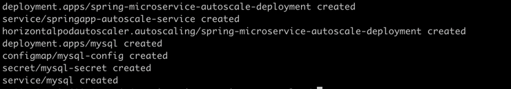
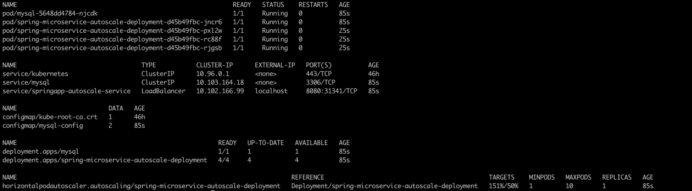
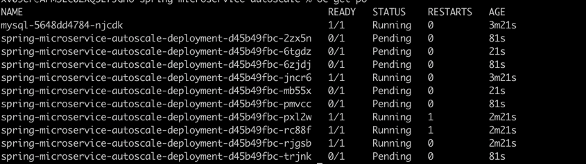
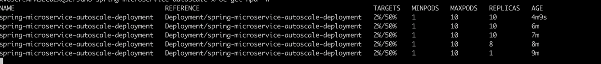
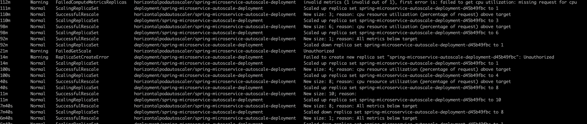

# HPA (Horizontel Pod AutoScaler) Demo with SpringBoot with K8s

### Pre requisite installation

* Java 11
* maven
* kubernetes docker for desktop/minikube

### Tech
* Java 11
* Springboot
* Spring-Data-Jpa
* Spring-Boot-Actuator
* Lombok
* Maven
* kubernetes
* Docker


### Build

 mvn clean install

```
Build docker image 

docker build -t spring-microservice-autoscale-deployment:v3 . 
```

### Run

1. Metricserver in docker for desktop is not enabled by default, apply follwoing command  

```
kubectl create -f metricsserver/
```

2. Deploy the k8s resources by following command 

```
kubectl create -f k8s/
```



3. check the k8s pod,service, deployment and hpa deployed in previous step 

```
kubectl get po,svc,deployment,hpa 
```


4. Check the pod status
```
kubectl get po
```


5. check the HPA status and observe the Targets column for resource consumption 

```
 kubectl get hpa
 ```


6. Wait for pod scale down to 1 (i.e, Min Replica Config)


7. Perform the Load Test . Run the below command in the separate command line window

```
while true; do curl http://localhost:8080/retrieve; done
```

8. Run below command in separate window to watch HPA status every 30 sec, observe Target column to see variations in the CPU consumptions

```
   kubectl get hpa -w
```

   
   
9. Check the Kuberentes events to understand scaling up and down events in background 

```
kubectl get events
```

   

10. terminate the load testing

11. Wait for sometime and verify change in HPA and Kubernetes events to scaling down the pod to minimum replica count , since CPU consumption is low

12. clean up resources <b>kubectl delete -f k8s/

## K8s Commands used

* kubectl create -f k8s/
* kubectl get po,svc,deployment,hpa
* kubectl get po
* kubectl get hpa -w
* kubectl get events
* kubectl describe deploy spring-microservice-autoscale-deployment
